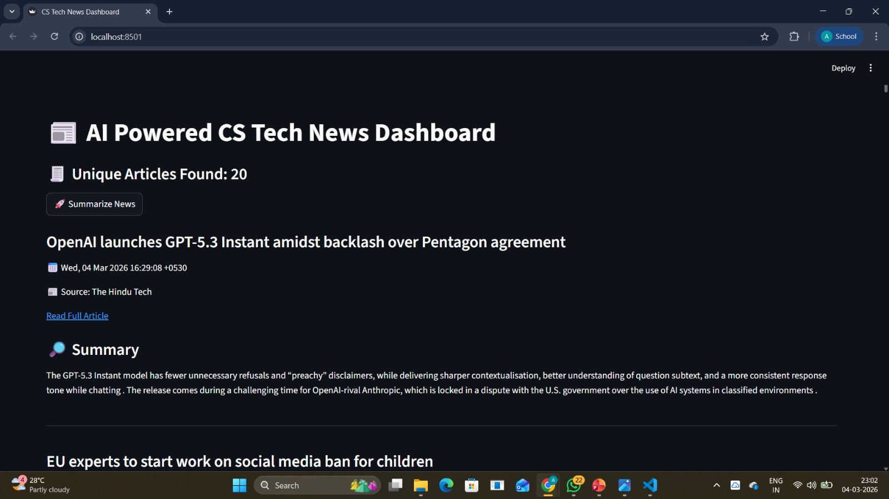

#  ML Powered Tech News Dashboard

This is a web app that shows latest tech news and summarizes them using ML.

## Features
- Fetches news from RSS feeds
- Removes duplicate articles
- Extracts full article content
- AI-based summarization
- Clean UI using Streamlit

## Technologies Used
- Python
- Streamlit
- Feedparser
- Newspaper3k
- Transformers

##  How to Run

1. Install dependencies:
pip install -r requirements.txt

2. Run the app:
streamlit run code.py

## Output

## Future Improvements
- Add filters
- Save summaries
- Deploy online
